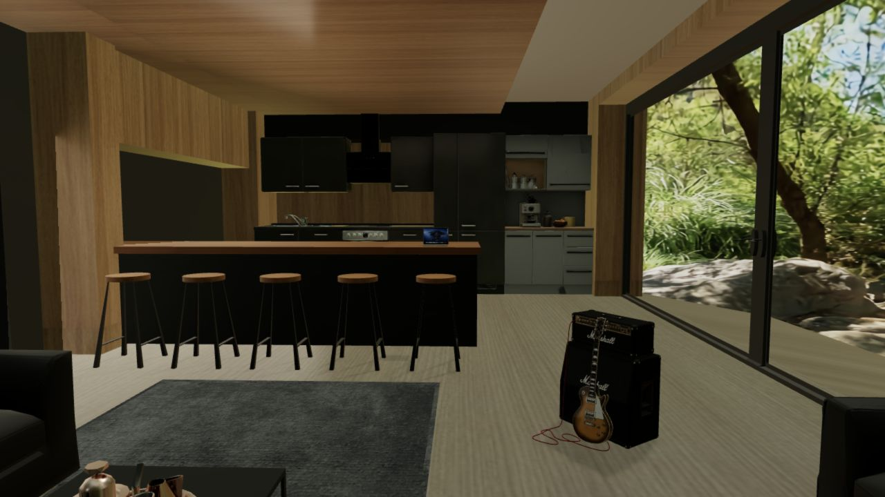
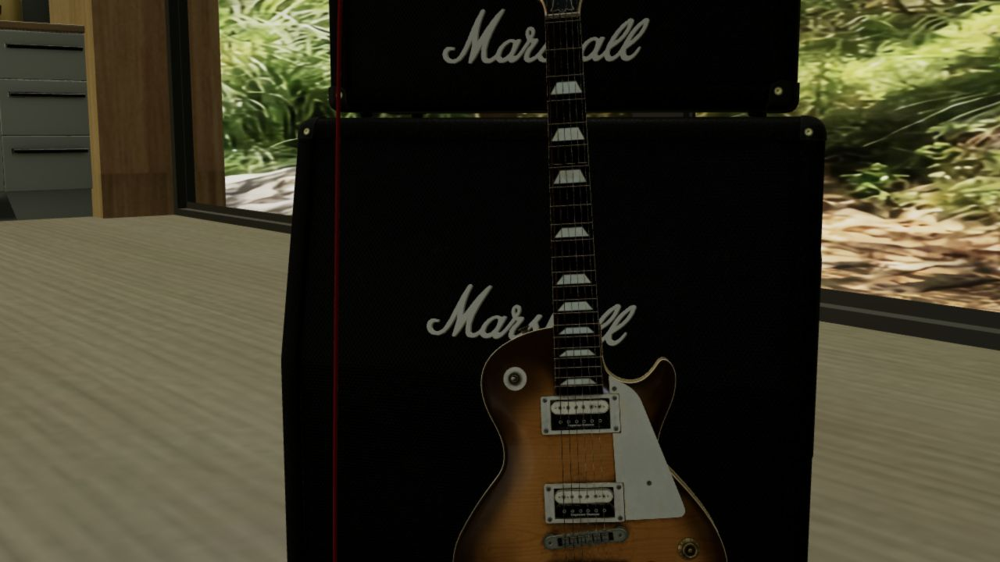
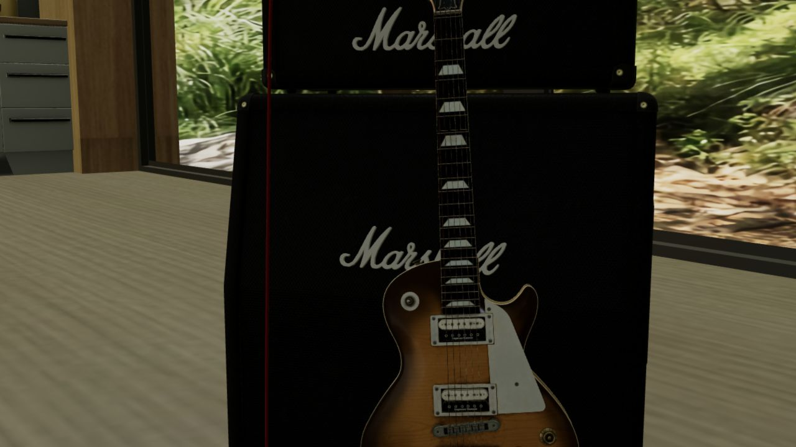
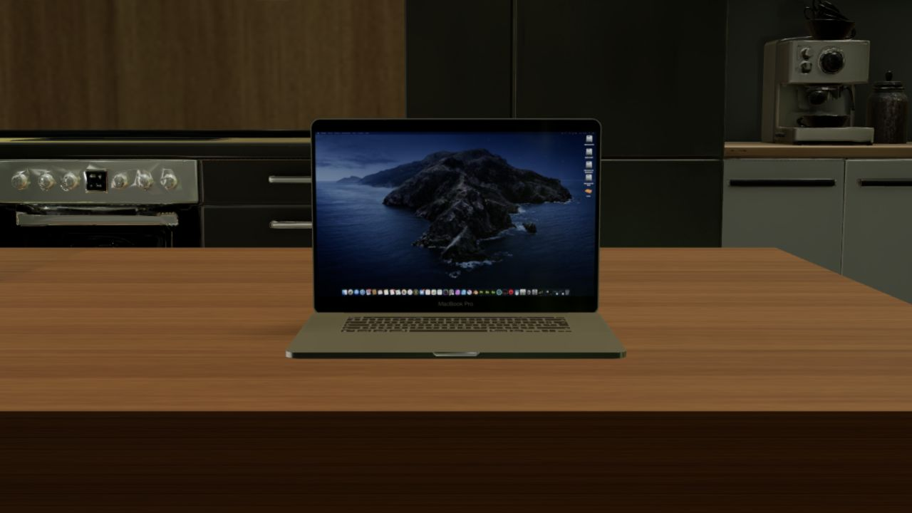
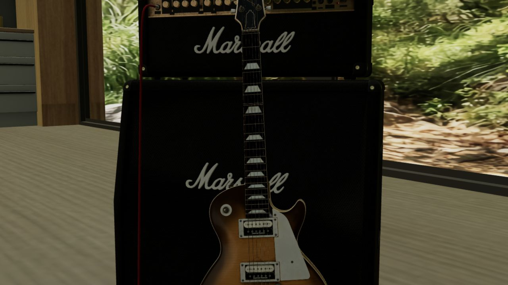

# Fred Studio V2 visual comparison

All comparisons use the accepted lighting, material overrides, object anchors, real-world scale, and an identical camera within each pair. The images were captured at DPR 1. No derivative was selected on triangle count alone.

## Opening composition

| Source | Conservative derivative |
|---|---|
|  |  |

Verdict: source-equivalent. The corrected split-parent normalisation reproduces the source world bounds (`1.0664 × 1.0227 × 1.091`, centre `[-2.0212, 0.5324, 1.392]`). Floor contact, MacBook contact, scale, orientation, room composition, and shadows remain aligned.

## Guitar geometry

| Version | Source triangles | Visible result | Decision |
|---|---:|---|---|
| Source split | 309,867 | Reference | KEEP SOURCE as rollback |
| Conservative | 239,989 | No visible loss in opening, front close-up, body, headstock, pickups, strings, binding, or side silhouette | ACCEPT |
| Light | 202,191 | No obvious loss in the captured views, but retains less close-detail geometry for only 232,380 bytes additional Meshopt saving versus conservative | ACCEPT WITH LIMITATION |
| Moderate | 169,335 | No obvious loss at the tested raster size; least geometry reserve for future closer views and only 441,888 bytes additional Meshopt saving versus conservative | REJECT — LOW BENEFIT |

Required close sequence:

| Source | Conservative | Light | Moderate |
|---|---|---|---|
|  |  |  |  |

Additional recovered evidence:

- Headstock and tuning hardware: `extra-guitar-head-source.png`, `extra-guitar-head-conservative.png`, `extra-guitar-head-light.png`, `extra-guitar-head-moderate.png`.
- Body, pickups, strings, bridge and lacquer: `extra-guitar-body-source.png`, `extra-guitar-body-conservative.png`, `extra-guitar-body-light.png`, `extra-guitar-body-moderate.png`.
- Side silhouette and binding: `extra-guitar-side-source.png`, `extra-guitar-side-recommended.png`.

The conservative reduction is component-weighted. The defining body silhouette remains at full retention; neck, strings, body detail, underside, and fretboard use separate retention levels. No non-uniform scaling is used and all offline bounds remain exactly equal to the split source bounds.

## Marshall geometry

| Version | Source triangles | Visible result | Decision |
|---|---:|---|---|
| Source split | 114,167 | Reference | KEEP SOURCE as rollback |
| Conservative | 108,875 | Logo, grille, corners, cabinet silhouette and control panel remain source-equivalent | ACCEPT |
| Light | 102,707 | No obvious captured loss, but Meshopt output is only 32,880 bytes smaller than conservative | REJECT — LOW BENEFIT |

| Source | Conservative | Light |
|---|---|---|
|  |  |  |

Control-panel evidence is in `extra-marshall-control-source.png`, `extra-marshall-control-conservative.png`, and `extra-marshall-control-light.png`. The conservative strategy preserves the label and small repeated hardware while applying only mild, component-specific simplification to the cabinet, panel, and accessory geometry.

## KTX2 material delivery

| Group | Source bytes | KTX2 bytes | Change | Visual / colour-space result | Decision |
|---|---:|---:|---:|---|---|
| Room | 24,059,568 | 29,360,656 | +22.0% | No visible colour shift in the opening comparison; runtime selected ASTC, but local first-room time was slower | REJECT — LOW BENEFIT |
| MacBook | 2,548,260 | 3,367,380 | +32.1% | Screen, aluminium and keyboard response remain source-equivalent | REJECT — LOW BENEFIT |
| Marshall split source | 19,443,612 | 17,551,760 | -9.7% | Logo, grille, tolex and control response remain source-equivalent | ACCEPT WITH LIMITATION; not selected globally |
| Guitar split source | 32,015,596 | 31,928,096 | -0.3% | Lacquer, binding, pickups and metal response remain source-equivalent | REJECT — LOW BENEFIT |

| MacBook source | MacBook KTX2 |
|---|---|
|  |  |

| Guitar source material | Guitar KTX2 material |
|---|---|
|  |  |

| Marshall source material | Marshall KTX2 material |
|---|---|
|  |  |

Colour textures are tagged sRGB; normal, metallic-roughness, and occlusion data remain linear. At both target viewports the local Apple/WebGL path selected `RGBA_ASTC_4x4_Format`. GPU memory therefore moves in the desired compressed direction, but the full KTX2 set grows from 76,709,284 to 82,207,892 bytes and did not improve the local load samples. Source textures are the visual-first delivery recommendation for this spike.

## Meshopt and opposite view

The recommended conservative source-texture combination is 71,118,900 bytes before Meshopt and 48,180,252 bytes after Meshopt, a 32.3% delivery saving for the same decoded triangles. Meshopt uses high compression, per-mesh quantisation volume, 14-bit position, 10-bit normal, and 12-bit UV quantisation. Opening, guitar side, and opposite-room captures show no decoded placement or appearance change.

Evidence: `extra-guitar-side-source.png`, `extra-guitar-side-recommended.png`, `extra-opposite-source.png`, and `extra-opposite-recommended.png`.

## Final visual decision

The conservative guitar and conservative Marshall are the strongest derivatives that provide meaningful geometry reduction while retaining the most visual reserve. The light and moderate versions remain useful measurement/rollback evidence, but are not recommended because the additional Meshopt byte saving is small relative to the reduced detail reserve.

VISUAL QUALITY VERDICT:
source-equivalent
